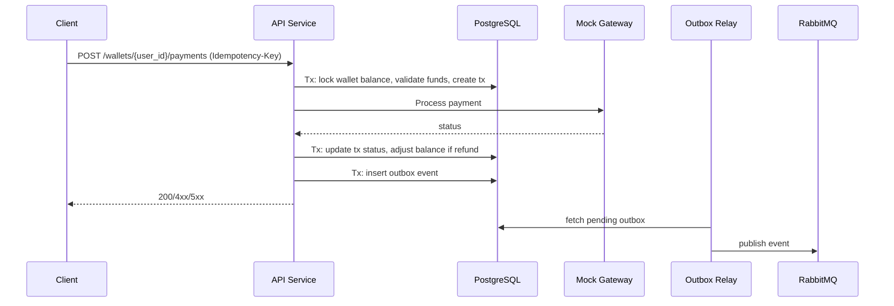
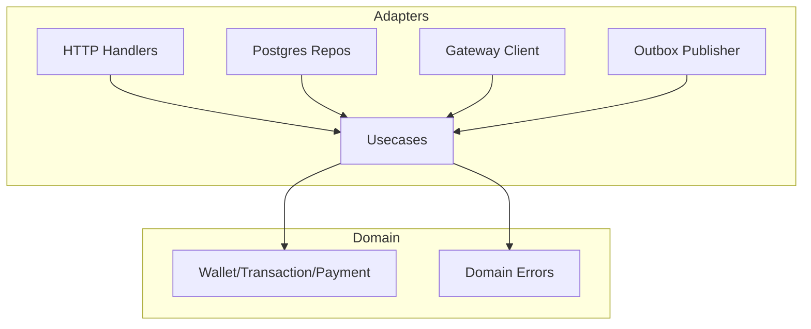

# System Overview
↩️ [Return to README](../../README.md)
## High-Level Architecture

<details>
<summary>Mermaid Code</summary>

```mermaid
flowchart LR
  Client[API Client] -->|HTTP/JSON| API[API Service (Gin)]
  API -->|Usecases| App[Application Layer]
  App -->|Repos| DB[(PostgreSQL)]
  App -->|Gateway Client| Gateway[Mock Payment Gateway]
  App -->|Outbox Writes| DB
  Relay[Outbox Relay] -->|Read Outbox| DB
  Relay -->|Publish| MQ[(RabbitMQ)]
  MQ --> Metrics[metrics-consumer]
  MQ --> Audit[audit-consumer]
```
</details>


## Request Flow (Payment)


<details>
<summary>Mermaid Code</summary>


</details>


## Layers (Clean/Hexagonal)
.svg)

<details>
<summary>Mermaid Code</summary>


</details>

## External Integrations
- Mock Payment Gateway via HTTP
- RabbitMQ for async domain events (outbox relay)

## Mock Payment Gateway (pasarela)
- Simulates payment processing with random delays/failures, but a interesting case to take into consideration is that
we handle retries with exponential backoff and circuit breaker pattern to avoid overwhelming the gateway during downtimes.
- Check this improvement that could be applied here.: [docs/improvements/gateway-resilience.md](docs/improvements/gateway-resilience.md).
The issue is if the gateway is down for a long period of time, the retries could take a long time to recover and the 
circuit breaker could be open for a long time as well, causing a bad user experience. 
A possible solution is to implement a fallback mechanism that could be used when the gateway is down for a long period of time.