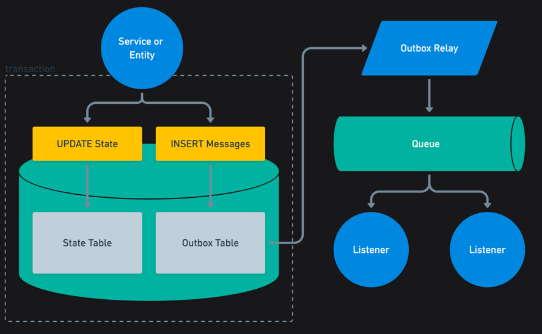

# Production Deployment Plan

↩️ [Return to README](../../README.md)
## Overview
This document outlines the production deployment strategy for the Wallet application like if we were to desploy this challenge into production, a Go-based service built with Gin framework. The application follows a layered architecture (inspired by Clean/Hexagonal Architecture) and incorporates the Transactional Outbox pattern for reliable event publishing.
The deployment targets *AWS*, leveraging managed services for scalability, security, and operational simplicity. Infrastructure is defined using `AWS CloudFormation` templates to ensure reproducible environments.

## Key goals:
Our key goals for the production deployment are, having a highly available, scalable, and secure architecture with minimal operational overhead.
Secure public exposure of API endpoints, provide a way to handle infrastructure through migrations from local Docker Compose setup (PostgreSQL + RabbitMQ) to AWS-native equivalents.
Also to ensure high availability and auto-scaling capabilities.

Recommended lectures:
- [DDD, Hexagonal, Onion, Clean, CQRS, … How I put it all together](herbertograca.comvaadin.com)
- [Domain-Driven Design (DDD) and Hexagonal Architecture in Java](https://vaadin.com/blog/ddd-part-3-domain-driven-design-and-the-hexagonal-architecture)

## Current Architecture
The application is structured as follows:

- API Service: Handles HTTP requests via Gin.
- Application Layer: Contains use cases and business logic.
- Persistence: PostgreSQL with repositories supporting transactions and locking.
- Outbox Pattern: Ensures reliable event publishing by writing events to a database table transactionally, then relaying them to a message queue.
- Consumers: Separate workers process metrics and audit events.

You can review the full architecture [here](docs/architecture/system-overview.md).

Following is the Outbox pattern flow:

## Production Architecture on AWS
The production setup migrates to managed AWS services:

- Database: Amazon Aurora PostgreSQL (compatible with existing drivers).
- Messaging: Amazon SQS (replaces RabbitMQ for simpler queues).
- Container Orchestration: Amazon ECS with Fargate (serverless containers).
- Batch/Scheduled Jobs: AWS Batch + EventBridge for the Outbox Relay.
- API Exposure: Application Load Balancer (ALB), optionally fronted by Amazon API Gateway.

## Core components:

▶️ Wallet API service (Gin) as an ECS service.

▶️ Workers (Outbox Relay, Metrics Consumer, Audit Consumer) as ECS services or Batch jobs.

▶️ Migrations executed as one-off ECS tasks.

## Infrastructure Provisioning
Infrastructure is provisioned via AWS CloudFormation stacks. Key resources include:

▶️ VPC with public/private subnets.

▶️ Aurora PostgreSQL cluster.

▶️ SQS queues (e.g., for outbox events, metrics, audit).

▶️ ECS cluster and task definitions.

▶️ Application Load Balancer (internet-facing or internal).

▶️ IAM roles with least-privilege policies.

▶️ Secrets Manager for credentials.

▶️ Deployments use CI/CD pipelines (e.g., GitHub Actions or AWS CodePipeline) to build Docker images, push to Amazon ECR, and update ECS services.

💡 My idea is try not to use Terraform or CDK for this, to keep things simple, but it's a valid option if preferred.

## Scaling
ECS services support automatic scaling:

✅ Target Tracking Scaling Policies based on CloudWatch metrics:
  - CPU/Memory utilization.
  - ALB request count per target. 
  - Custom metrics (e.g., SQS queue depth for workers).

✅ Minimum and maximum task counts configured per service.
✅ High availability across multiple Availability Zones.

## Exposing API Endpoints
The Wallet API is exposed publicly via HTTPS:

Its possible to use Amazon API Gateway HTTP API (for additional features) adding a private ALB via VPC Link that
Provides Cognito authentication, throttling, usage plans, and detailed metrics.

## Security measures:

Use AWS WAF for threat protection, security groups restricting traffic, and Cognito User Pools for authentication (integrated via JWT middleware in Gin). We can even consider use an external tenant like auth0 if preferred.

## Monitoring and Observability
For loggin we can use CloudWatch for all ECS tasks, with metrics and alarms on key indicators (CPU, queue depth, errors). Optionally, integrate with Datadog for advanced dashboards, APM tracing, and custom metrics.

This deployment ensures the application is scalable, secure, and maintainable in production.